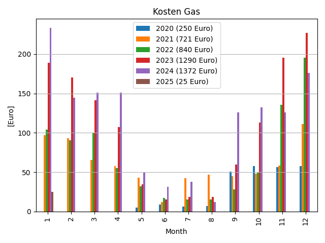
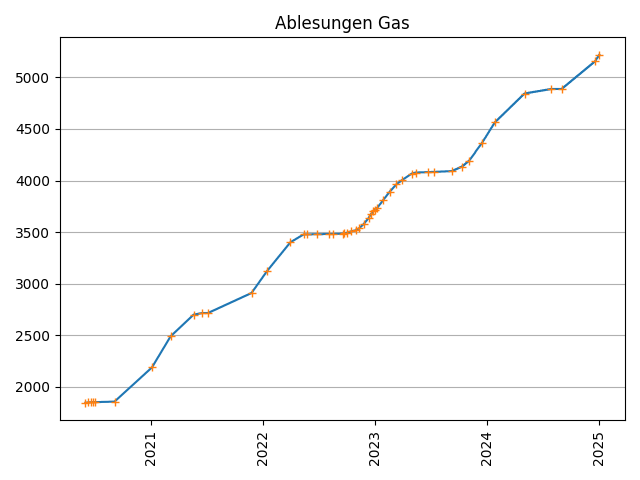
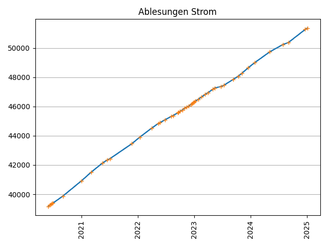

# energie

a tool to visualize readings for gas, electricity and water consumption.

```
Call:
python3 energie.py
```

## Input
Data is retrieved from Google Spreadsheets via Google API.

Example:
```
Datum	Strom	Gas	Wasser
31.05.2020	39184	1846.15	329
10.06.2020	39256	1849.76	333
18.06.2020	39300	1850.79	335
24.06.2020	39344	1851.82	337

Preise [€]			
	Strom		
Datum	Arbeitspreis	Grundpreis	
31.05.2020	0.26	26.83	Grünwelt Energie
25.06.2021	0.32	11.83	EnBW
29.06.2021	0.3	19.9	Süwag
28.06.2022	0.4	16.9	Vattenfall
31.12.2023	0	0	

	Gas		
Datum	Arbeitspreis	Grundpreis	
31.05.2020	0.06	5	
25.06.2021	0.07	5.5	EnBW
29.06.2021	0.07	15.88	
28.06.2022	0.15	12.5	Vattenfall

	Wasser	
Datum	Arbeitspreis	Grundpreis
31.05.2020	1.96	5
01.01.2021	2.01	4.9
01.01.2022	2.01	4.9
```

Useful Links:
- [Link to Google Developers](https://developers.google.com/sheets/api/quickstart/python)
- [Link to Tutorial](https://medium.com/analytics-vidhya/how-to-read-and-write-data-to-google-spreadsheet-using-python-ebf54d51a72c)

## Output
Based on the readings, two plots are created for gas, electricity and water respectively.

The plots are shown in the following:

### Gas




### Electricity




### Water


## Ideas for Further Development
- add additional interfaces for input (such as local xls or csv file)

