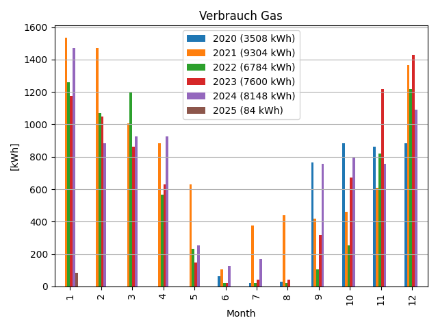
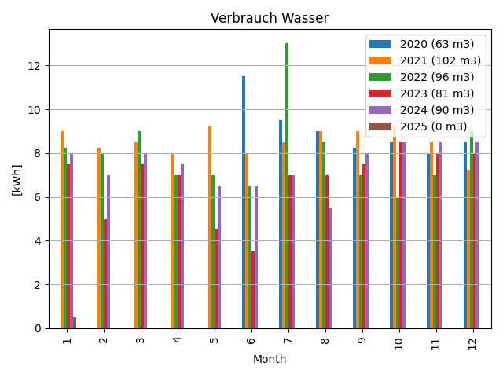
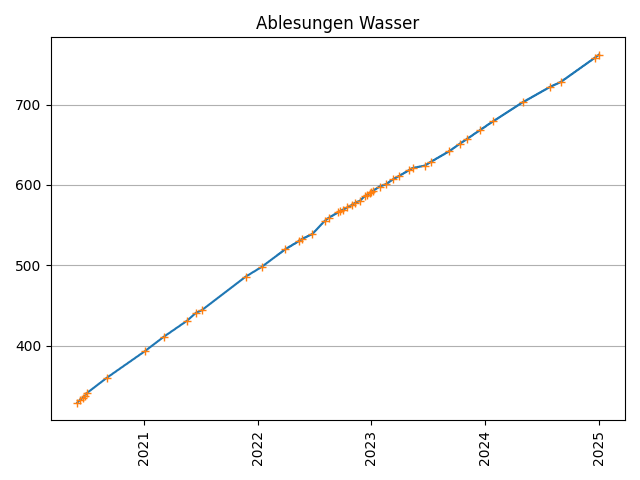

# energie

a tool to visualize readings for gas, electricity and water consumption.

```
Call:
python3 energie.py
```

## Input
Data is retrieved from Google Spreadsheets via Google API.

Useful Links:
- [Link to Google Developers](https://developers.google.com/sheets/api/quickstart/python)
- [Link to Tutorial](https://medium.com/analytics-vidhya/how-to-read-and-write-data-to-google-spreadsheet-using-python-ebf54d51a72c)

## Output
Based on the readings, two plots are created for gas, electricity and water respectively.

The plots are shown in the following:

### Gas



### Electricity


### Water



## Ideas for Further Development
- add additional interfaces for input (such as local xls or csv file)

